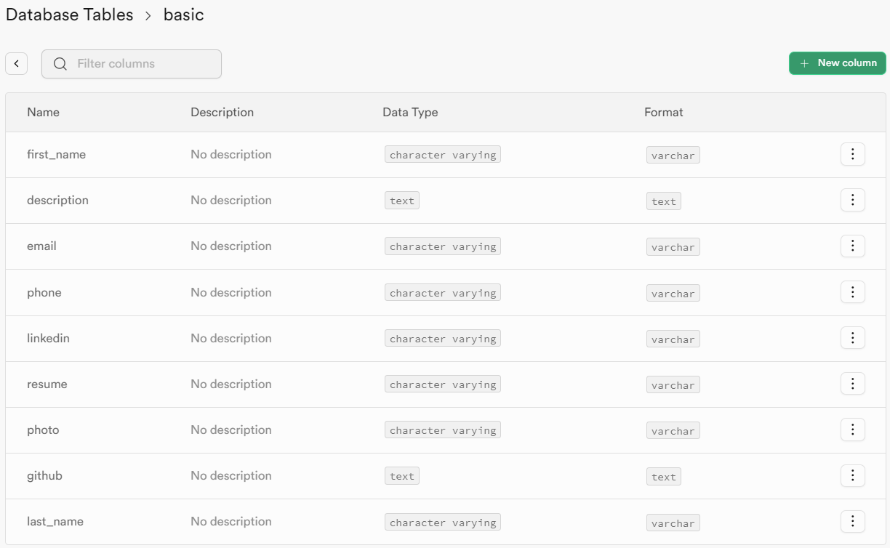
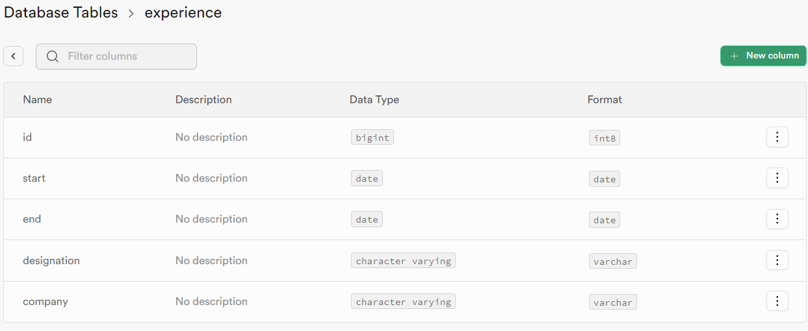
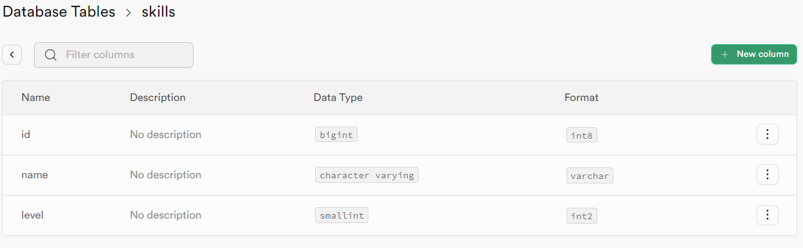
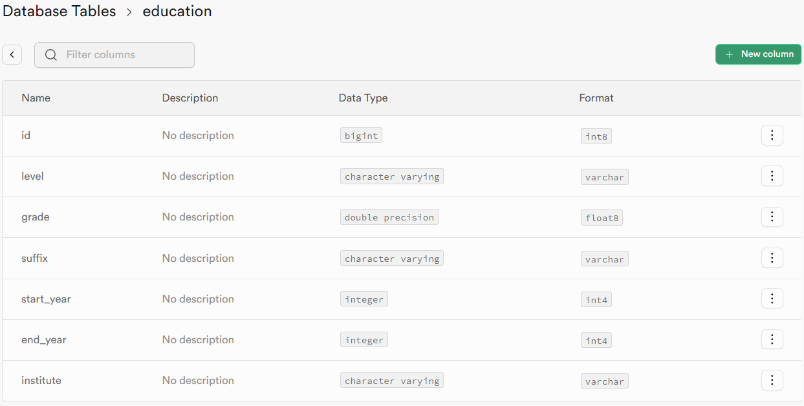

This is an open source portfolio website made with NextJs with a Supabase backend.

## Getting started
### Setting up Supabase
1. Visit supabase [website](https://supabase.com/dashboard/projects) and create a new project
2. Create a new database 
3. Create tables `basic`, `skills`, `experience` and `education`





### Install dependencies and start 
Make a `.env.local` file with the following contents
```
NEXT_PUBLIC_SUPABASE_URL=https://xxxxx.supabase.co
NEXT_PUBLIC_SUPABASE_KEY=XXXXXXXXXXXXXXXXXXXXXXXXXXXXXXXXXXXX
```

Install dependencies
```
npm ci
```

Start development server
```
npm run dev
```

